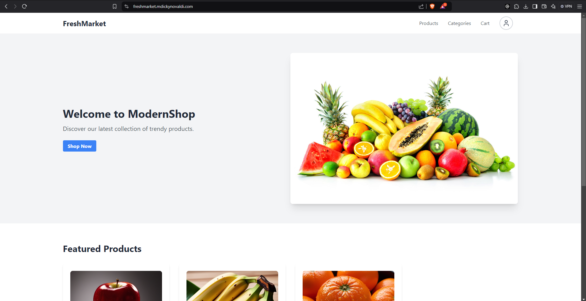
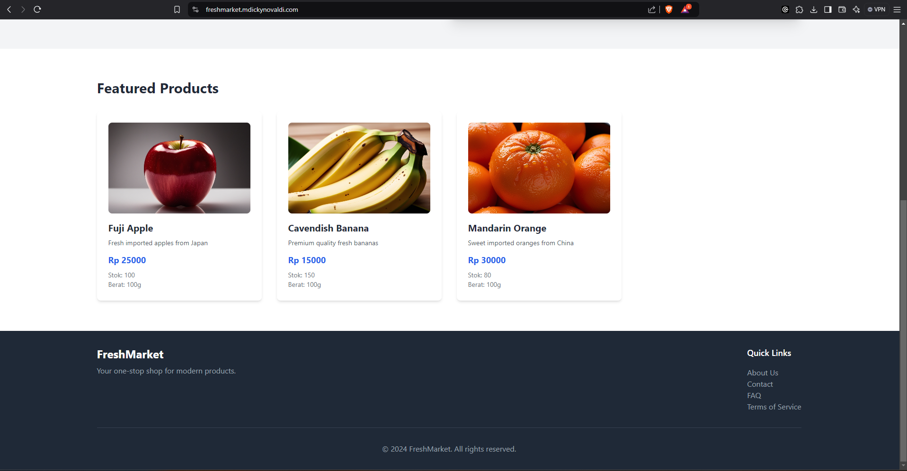
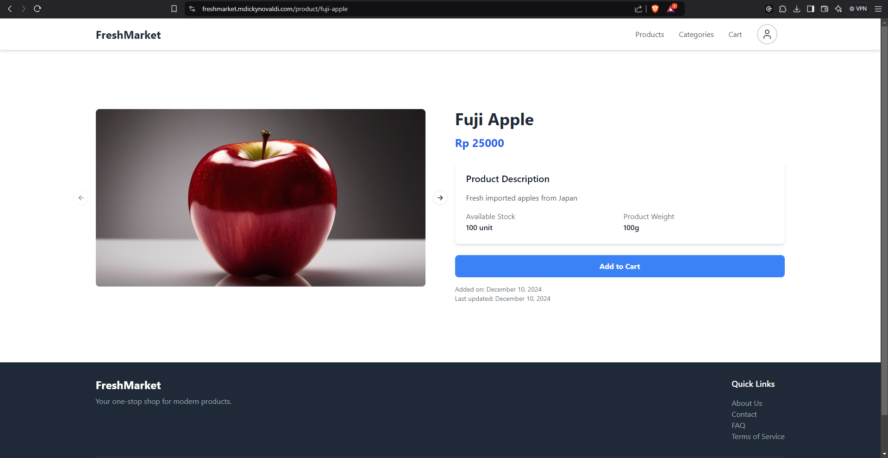
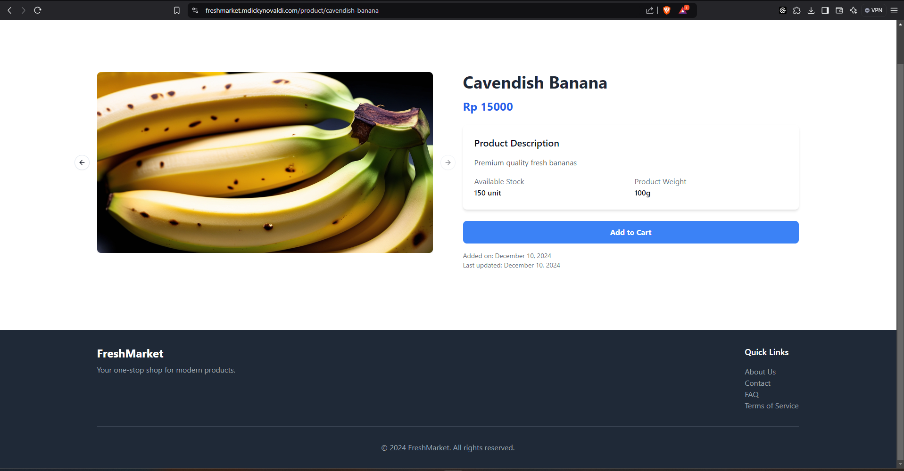
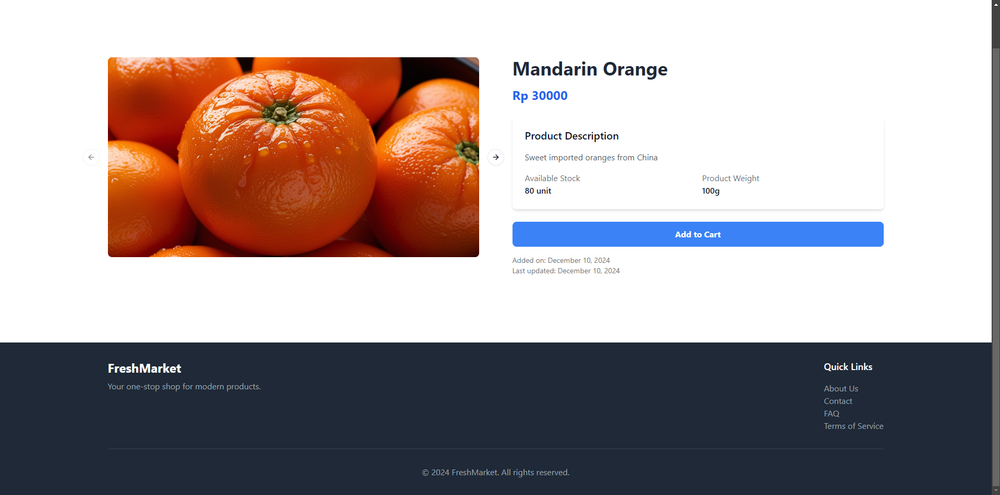

# 🛒 FreshMarket Frontend

<div align="center">
  
  
  [](https://reactjs.org/)
  [](https://tailwindcss.com/)
  [](LICENSE)
</div>

<h2 id="table-of-contents">📝 Table of Contents</h2>

- [Description](#description)
- [Key Features](#key-features)
- [Technologies Used](#technologies-used)
- [Getting Started](#getting-started)
  - [Prerequisites](#prerequisites)
  - [Installation](#installation)
- [Scripts](#scripts)
- [Contributing](#contributing)
- [License](#license)
- [Contact](#contact)
- [Screenshots](#screenshots)

<h2 id="description">📝 Description</h2>

FreshMarket is a web application designed to make it easier for users to shop for daily necessities online. This project is the frontend part of the FreshMarket application responsible for user interface and user interaction.

<h2 id="key-features">✨ Key Features</h2>

- 🛍️ **Shopping Cart**: Add products to cart and view total prices
- 💳 **Checkout**: Easy and secure payment processing
- 📱 **Responsive**: Design that adapts to various screen sizes
- 🔍 **Product Search**: Easy product search
- 👤 **Account Management**: Manage profiles and order history

<h2 id="technologies-used">🛠️ Technologies Used</h2>

- **React** - JavaScript library for building user interfaces
- **Tailwind CSS** - Utility-first CSS framework for responsive styling
- **TypeScript** - Static typed JavaScript superset
- **Vite** - Next generation frontend tooling
- **Radix UI** - Accessible UI components
- **React Router** - Routing for React applications
- **Zod** - TypeScript-focused schema validation

<h2 id="getting-started">🚀 Getting Started</h2>

<h3 id="prerequisites">Prerequisites</h3>

- [Node.js](https://nodejs.org/) (version 18 or newer)
- [Bun](https://bun.sh/) - JavaScript runtime & package manager

<h3 id="installation">Installation</h3>

1. Clone this repository

   ```bash
   git clone https://github.com/username/freshmarket-frontend.git
   cd freshmarket-frontend
   ```

2. Install dependencies

   ```bash
   bun install
   ```

3. Copy environment file

   ```bash
   cp .env.example .env
   ```

4. Configure environment

   ```sh
   VITE_BACKEND_API_URL=http://localhost:3000
   ```

5. Generate types from OpenAPI

   ```bash
   bun run schema
   ```

6. Run the application

   ```bash
   bun dev
   ```

   The application will run at `http://localhost:5173`

<h2 id="scripts">📦 Scripts</h2>

- `bun dev` - Run development server
- `bun build` - Build application for production
- `bun preview` - Preview production build
- `bun lint` - Run linter
- `bun schema` - Generate types from local OpenAPI
- `bun schema:prod` - Generate types from production OpenAPI

<h2 id="contributing">🤝 Contributing</h2>

We welcome contributions from everyone! Here's how you can contribute:

1. Fork this repository
2. Create a new feature branch (`git checkout -b new-feature`)
3. Commit your changes (`git commit -m 'Add new feature'`)
4. Push to the branch (`git push origin new-feature`)
5. Create a Pull Request

<h2 id="license">📄 License</h2>

This project is licensed under the [MIT License](LICENSE).

<h2 id="contact">📧 Contact</h2>

For further questions, please contact:

- Email: [mochdickyn@gmail.com](mailto:mochdickyn@gmail.com)
- Website: [mdickynovaldi.com](https://mdickynovaldi.com)

<h2 id="screenshots">📸 Screenshots</h2>

<div align="center">
  
  
  
  
  
</div>
